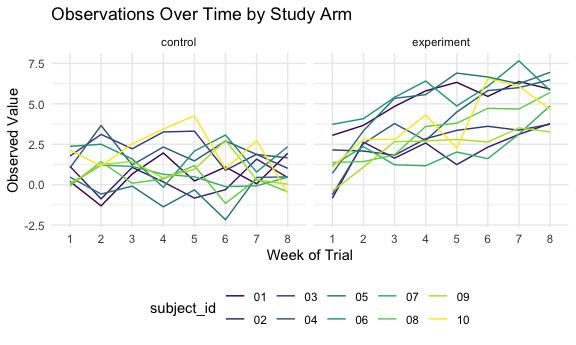

Homework 5
================
Emily Bamforth
18 November 2020

``` r
library(tidyverse)
```

    ## ── Attaching packages ─────────────────────────────────────────────────────────────── tidyverse 1.3.0 ──

    ## ✓ ggplot2 3.3.2     ✓ purrr   0.3.4
    ## ✓ tibble  3.0.3     ✓ dplyr   1.0.2
    ## ✓ tidyr   1.1.2     ✓ stringr 1.4.0
    ## ✓ readr   1.3.1     ✓ forcats 0.5.0

    ## ── Conflicts ────────────────────────────────────────────────────────────────── tidyverse_conflicts() ──
    ## x dplyr::filter() masks stats::filter()
    ## x dplyr::lag()    masks stats::lag()

``` r
library(readr)
library(patchwork)

knitr::opts_chunk$set(
  fig.width = 6,
  fig.asp = .6,
  out.width = "90%"
)

theme_set(theme_minimal() + theme(legend.position = "bottom"))

options(
  ggplot2.continuous.colour = "viridis",
  ggplot2.continuous.fill = "viridis"
)

scale_colour_discrete = scale_colour_viridis_d
scale_fill_discrete = scale_fill_viridis_d
```

## Problem 1

Read in the data.

``` r
homicide_df =
  read_csv("data_prob1/homicide-data.csv") %>% 
  mutate(
    city_state = str_c(city, state, sep = "_"),
    resolved = case_when(
      disposition == "Closed without arrest" ~ "unsolved",
      disposition == "Open/No arrest"        ~ "unsolved",
      disposition == "Closed by arrest"      ~ "solved",
    )
  ) %>% 
  select(city_state, resolved) %>% 
  filter(city_state != "Tulsa_AL")
```

    ## Parsed with column specification:
    ## cols(
    ##   uid = col_character(),
    ##   reported_date = col_double(),
    ##   victim_last = col_character(),
    ##   victim_first = col_character(),
    ##   victim_race = col_character(),
    ##   victim_age = col_character(),
    ##   victim_sex = col_character(),
    ##   city = col_character(),
    ##   state = col_character(),
    ##   lat = col_double(),
    ##   lon = col_double(),
    ##   disposition = col_character()
    ## )

Let’s look at this a bit

``` r
aggregate_df =
  homicide_df %>% 
  group_by(city_state) %>% 
  summarize(
    hom_total = n(),
    hom_unsolved = sum(resolved == "unsolved")
  )
```

    ## `summarise()` ungrouping output (override with `.groups` argument)

Can I do a prop test for a single city?

``` r
prop.test(
  aggregate_df %>% filter(city_state == "Baltimore_MD") %>% pull(hom_unsolved),
    aggregate_df %>% filter(city_state == "Baltimore_MD") %>% pull(hom_total)) %>% 
  broom::tidy()
```

    ## # A tibble: 1 x 8
    ##   estimate statistic  p.value parameter conf.low conf.high method    alternative
    ##      <dbl>     <dbl>    <dbl>     <int>    <dbl>     <dbl> <chr>     <chr>      
    ## 1    0.646      239. 6.46e-54         1    0.628     0.663 1-sample… two.sided

Try to iterate…

``` r
results_df =
  aggregate_df %>% 
   mutate(
    prop_tests = map2(.x = hom_unsolved, .y = hom_total, ~prop.test(x = .x, n = .y)),
    tidy_tests = map(.x = prop_tests, ~broom::tidy(.x))
  ) %>% 
  select(-prop_tests) %>% 
  unnest(tidy_tests) %>% 
  select(city_state, estimate, conf.low, conf.high)
```

``` r
results_df %>% 
  mutate(city_state = fct_reorder(city_state, estimate)) %>% ggplot(aes(x = city_state, y = estimate)) +
  geom_point() +
  geom_errorbar(aes(ymin = conf.low, ymax = conf.high)) +
  theme(axis.text.x = element_text(angle = 90, vjust = 0.5, hjust = 1))
```


# Problem 2

First, let’s read in one dataset:

``` r
data_1 = read_csv("data_prob2/con_01.csv")
```

    ## Parsed with column specification:
    ## cols(
    ##   week_1 = col_double(),
    ##   week_2 = col_double(),
    ##   week_3 = col_double(),
    ##   week_4 = col_double(),
    ##   week_5 = col_double(),
    ##   week_6 = col_double(),
    ##   week_7 = col_double(),
    ##   week_8 = col_double()
    ## )

This has the data for one study participant; there is one row for the
patient, and each column is a some sort of observed value per each week
of the study.

Then, let’s create a dataframe with all file names, and read in the data
from each subject:

``` r
path_df =
  tibble(
    path = list.files("data_prob2")) %>% 
  mutate(
    path = str_c("data_prob2/", path),
    data = map(path, read.csv)
    ) %>% 
  unnest(cols = data)

read_csv(path_df$path[[1]])
```

    ## Parsed with column specification:
    ## cols(
    ##   week_1 = col_double(),
    ##   week_2 = col_double(),
    ##   week_3 = col_double(),
    ##   week_4 = col_double(),
    ##   week_5 = col_double(),
    ##   week_6 = col_double(),
    ##   week_7 = col_double(),
    ##   week_8 = col_double()
    ## )

    ## # A tibble: 1 x 8
    ##   week_1 week_2 week_3 week_4 week_5 week_6 week_7 week_8
    ##    <dbl>  <dbl>  <dbl>  <dbl>  <dbl>  <dbl>  <dbl>  <dbl>
    ## 1    0.2  -1.31   0.66   1.96   0.23   1.09   0.05   1.94

Next, time to tidy\!

``` r
path_df =
path_df %>% 
  mutate(path = str_replace(path, "data_prob2/", "")) %>% 
  mutate(path = str_replace(path, ".csv", "")) %>% 
  separate(path, into = c("study_arm", "subject_id"), sep = "_") %>% 
  mutate(study_arm = if_else(study_arm == "con", "control", "experiment")) %>% 
  relocate("subject_id", "study_arm") %>% 
  pivot_longer(week_1:week_8, names_to = "week", values_to = "observed_value") %>% 
  mutate(week = str_replace(week, "week_", ""))
```

Our resulting dataframe is organized wherein each row is an observed
value. Our columns include the `subject_id` and the `study_arm` (control
or experiment), the `week` of the observation and the `observed_value`.
There are 160 rows in the dataset.

After tidying the data, time to plot:

``` r
ggplot(path_df, aes(x = week, y = observed_value, group = subject_id)) +
  geom_line(aes(color = subject_id)) + facet_grid(. ~ study_arm) +
  labs(
    title = "Observations Over Time by Study Arm",
    x = "Week of Trial",
    y = "Observed Value"
  )
```



Upon plotting the data, we can visualize that the experiment arm
generally has higher observed values (going from around 0 up to 7.5)
than the control group (going from around -2.5 to 4.5).
